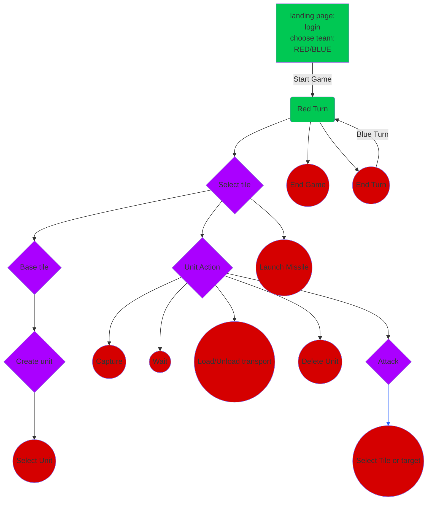

```mermaid
flowchart TD
    A["landing page:<br>login<br>choose team:<br>RED/BLUE"] -- Start Game --> B("Red Turn")
    B --> C{"Select tile"} & Q(("End Game")) & X(("End Turn"))
    C --> D{"Base tile"} & E{"Unit Action"} & O(("Launch Missile"))
    E --> G{"Attack"} & I(("Capture")) & J(("Wait")) & K(("Load/Unload transport")) & P(("Delete Unit"))
    D --> L{"Create unit"}
    L --> N(("Select Unit"))
    G --> M(("Select Tile or target"))
    X -- Blue Turn --> B
    style A fill:#00C853
    style B fill:#00C853
    style C fill:#AA00FF
    style Q fill:#D50000
    style X fill:#D50000
    style D fill:#AA00FF
    style E fill:#AA00FF
    style O fill:#D50000
    style G fill:#AA00FF
    style I fill:#D50000
    style J fill:#D50000
    style K fill:#D50000
    style P fill:#D50000
    style L fill:#AA00FF
    style N fill:#D50000
    style M fill:#D50000
    linkStyle 14 stroke:#2962FF,fill:none
```