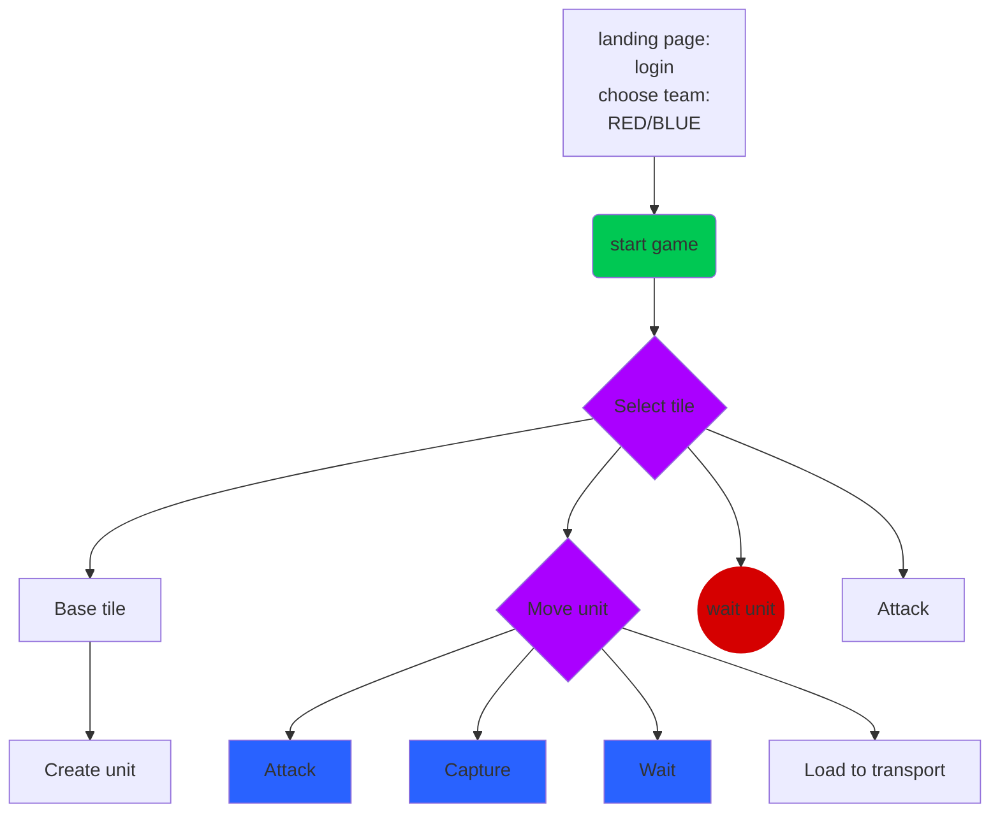

```mermaid
flowchart TD
    A["landing page:<br/>login<br/>choose team:<br/>RED/BLUE"] --> B("start game")
    B --> C{"Select tile"}
    C --> D["Base tile"]
    C --> E{"Move unit"}
    C --> F(("wait unit"))
    C --> G["Attack"]
    E --> H["Attack"]
    E --> I["Capture"]
    E --> J["Wait"]
    E --> K["Load to transport"]
    D --> L["Create unit"]
    style B fill:#00C853
    style C fill:#AA00FF
    style E fill:#AA00FF
    style F stroke:#D50000,fill:#D50000
    style H fill:#2962FF
    style I fill:#2962FF
    style J fill:#2962FF
```